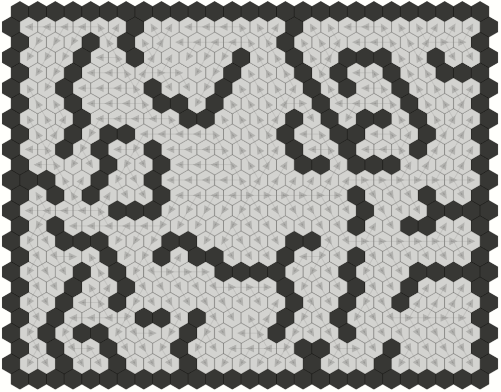
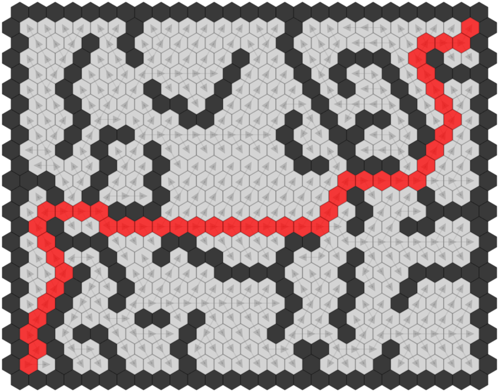
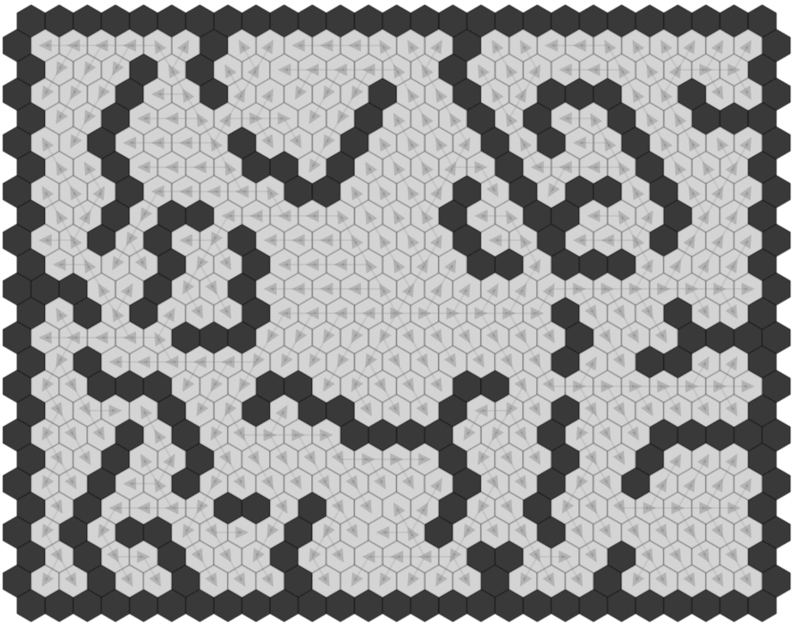

# BFS Visualiser React

A Visualiser for the [Breadth First Search (BFS) algorithm](https://en.wikipedia.org/wiki/Breadth-first_search) - built using the [React JavaScript Library](https://reactjs.org/).

The grid is made up of a series of regular hexagons. Some of these hexagons are designated walls, through which a path cannot travel.

The BFS algorithm is ran between two user defined points. The user defines the start point by mouse clicking on a non-wall hexagon, the BFS algorithm is then applied from this point to all other non-wall hexagons to find the shortest path between the two hexagons whilst avoiding walls. The use can then hover over any other non-wall hexagon to reveal the BFS shortest path.

Arrows on each non-wall hexagon signify the direction from which the given hexagon was visited during the BFS algorithm run.

*Demonstration of the Visualiser*

## Screenshots

*Canvas showing a path from the starting hexagon in the bottom left to the destination hexagon in the top right*

*Blank Canvas*

